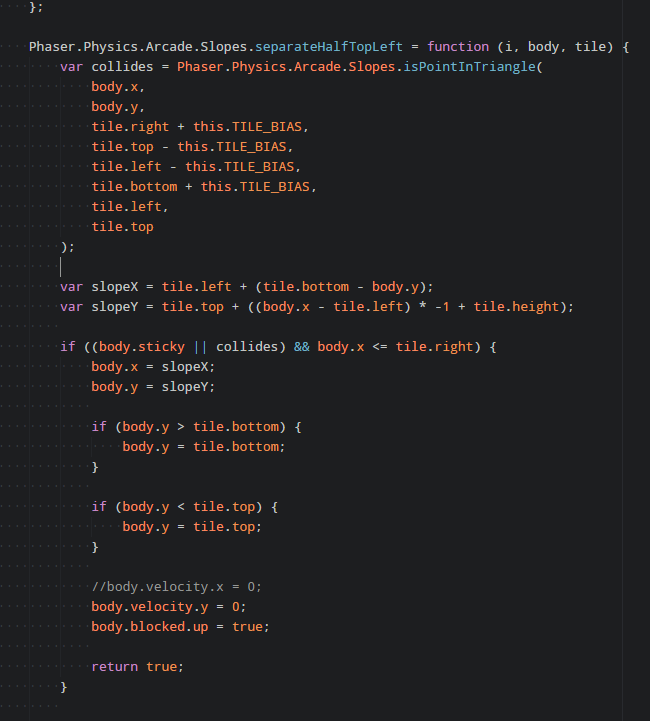
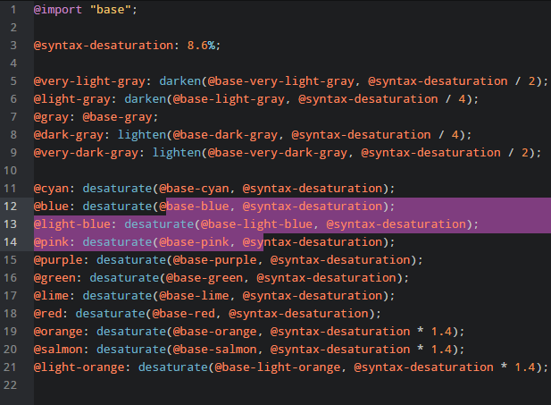

# Darya syntax theme

Darya's syntax theme for the Atom text editor.

```php
<?php
use Darya\Theme;

$theme = new Theme(Theme\Flavour::DARK);
$theme->display();
```

Geared towards PHP but works nicely for other languages too.






Inspired by a blend of [this colour palette](http://www.colourlovers.com/palette/1452889/Make_You_Change)
and the well known [Tomorrow Night](https://github.com/chriskempson/tomorrow-theme)
theme.
